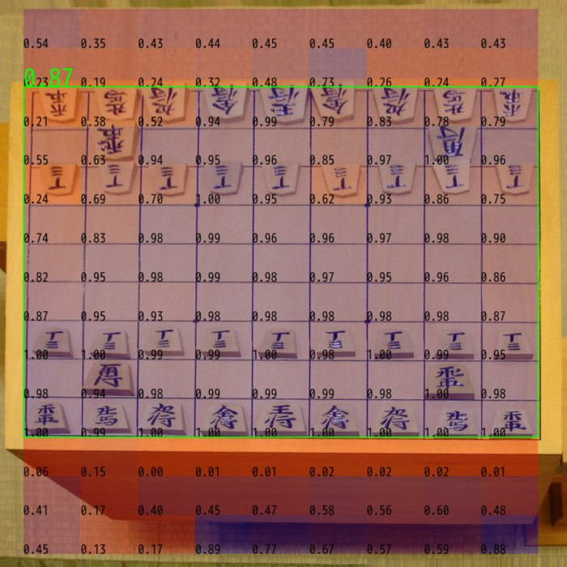

Shogi Recognizer
================
Detect shogi (chess-like game) board state from photo.

Bootstrapping
----------
Written here for reference. However this procedure is
not programatically reproducible, because
it's very hard and non-rewarding to maintain programs to insert manual
annotation (mostly rejection of failed samples) here and there.

1. Prepare photos with boards in the initial configuration `D0`
2. Extract piece patches from `D0` using (non-ML) image processing pipeline
3. Collect empty vs. non-empty labels using rotation-invariance, and train classifier `C0`
4. Use `C0` to `D0` and guess rotation
5. With rotations, we get labels for empty and non-promoted piece types , train classifier `C1` (also re-train `C0` -> `C0'`)
6. Train cell validness classifier `C2` using `D0` (__<- we're here__)
7. Use `C2` to aid grid estimation in step 2

Dataset & Classifiers
----------
### emptiness
* input: 80x80 RGB image of valid cell
* output: {empty, occupied} (2 categories)

### types-up
* input: 80x80 RGB image of valid cell, piece must point upward if applicable
* output: {empty, FU, ..., OU} (15 categories)

### validness
* input: 80x80 RGB image of valid cell OR invalid patches generated from incorrect grid estimation
* output: {invalid, valid} (2 categories)

### Word definitions
#### valid cell
A cell with or without a piece. If a piece exists, it must point one
of the 4 directions. Also, cell square must be contained completely
in the image (touching edge is ok).

Programs
----------
* `issue_id.py`: Merge files into a directory, assigning nice (safe, unique, short) keys
* `preprocess.py`: Extract cell images from raw photos
* `classify.py`: Train / use cell image classifier

Dependency
----------
You need [lsd-python](https://github.com/xanxys/lsd-python) line segment
detector to run `./preprocess.py`. Note that lsd-python is Affero GPL3,
while this repo is MIT licensed (i.e. You can't use this python code
on server side without disclosing server source code).

Useful Techniques
----------
### Manually selecting good data generated from unstable detector
`./preprocess.py --debug` forces fixed seed, with that, you can update `--blacklist` to reject bad data after inspecting data.

Recognition Steps
----------

References
----------
* [J. C. Bazin, et al.: 3-line RANSAC for Orthogonal Vanishing Point Detection, IROS, 2012](http://graphics.ethz.ch/~jebazin/papers/IROS_2012.pdf)
